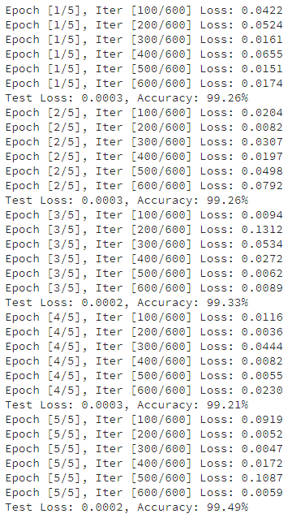

# Develop Deep Learning model by Pytorch
- SqueezeNet
  1) SqueezeNet in the paper at ICLR 2017
  2) SqueezeNet fitted CIFAR-10 dataset
  3) SqueezeNet fitted MNIST dataset

- Result of SqueezeNet about MNIST dataset
  1) 